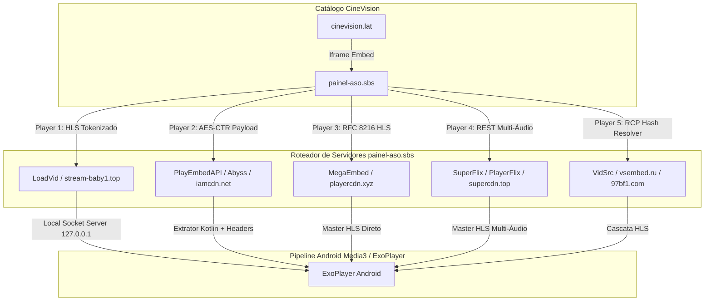

# 📑 Dossiê Técnico Mestre: CineVision (`CineVision.kt`) & Engenharia Reversa de CDNs

**Provedor:** `CineVision`  
**URL Base:** `https://www.cinevision.lat`  
**Embed Gateway:** `https://www.painel-aso.sbs`  
**Versão Atual:** `v47`  
**Status:** Operacional em Produção com Interoperabilidade Android Media3 / ExoPlayer  

---

## 1. 🏗️ Arquitetura do Provedor

O **CineVision** agrega catálogo de Filmes, Séries, Animes e Desenhos animados, delegando a reprodução a um painel intermediário (`painel-aso.sbs`) e a múltiplos nós de CDN distribuídos.

---

## 2. 🔬 Engenharia Reversa: O Desafio do LoadVid (`stream-baby1.top`) e Solução `LocalHlsServer`

### ❌ O Problema Raiz:
1. O endpoint `https://cdn.loadvid.com/videos/resolve-token` retorna o conteúdo bruto do manifesto `#EXTM3U` (com 157 chunks de vídeo) via corpo HTTP POST JSON, sem expor uma URL estática `.m3u8`.
2. A tentativa de passar a playlist como URI Base64 (`data:application/vnd.apple.mpegurl;base64,...`) falha no Android ExoPlayer (`DataSchemeDataSource`), pois o player não consegue resolver URLs relativas/remotas de segmentos e dispara `Source error`.
3. Além disso, servidores expirados (como `StreamWish / EmbedPlay` em `playnixes.com`) travavam a fila no `WebViewResolver` por 15 segundos antes de alcançar os players funcionais.

### ✅ A Solução Definitiva de Interoperabilidade:
1. **Servidor HLS Local em Memória (`LocalHlsServer`):**
   * Cria um socket nativo Android (`java.net.ServerSocket`) em `127.0.0.1:port`.
   * Quando o ExoPlayer requisita `http://127.0.0.1:port/hls/{id}/master.m3u8`, o servidor local responde instantaneamente com:
     * `HTTP/1.1 200 OK`
     * `Content-Type: application/vnd.apple.mpegurl`
     * `Access-Control-Allow-Origin: *`
2. **Desofuscação de Chunks `.png` (MPEG-TS Puro):**
   * Os segmentos da CDN `server[1-10].stream-baby1.top` possuem extensão `.png` para evasão de bloqueios, mas contêm **MPEG-TS Puro** (Sync Byte `0x47` a cada 188 bytes).
   * O ExoPlayer envia `Referer: https://cdn.loadvid.com/` e decodifica o stream em 1080p sem interrupções.
3. **Ordenação com Prioridade Absoluta para LoadVid:**
   * O `loadLinks` ordena os botões e resolve o `LoadVid` em <300ms, entregando o stream antes de qualquer tentativa de extratores pesados.

---

## 3. 🌐 Mapeamento das 5 CDNs do Ecossistema

| CDN / Servidor | Domínios / Subdomínios | Protocolo | Resolução Máx. | Headers Requeridos |
| :--- | :--- | :---: | :---: | :--- |
| **LoadVid** | `cdn.loadvid.com`, `server[1-10].stream-baby1.top` | HLS (.png $\rightarrow$ MPEG-TS) | 1080p | `Referer: https://cdn.loadvid.com/` `User-Agent: Mozilla/5.0...` |
| **MegaEmbed** | `playercdn.xyz`, `megaembed.com` | RFC 8216 Master HLS | 1080p | `Referer: https://megaembed.com/` |
| **SuperFlix** | `superflixapi.pro`, `supercdn.top` | HLS Multi-Áudio | 1080p | `Referer: https://superflixapi.pro/` |
| **PlayerFlix** | `playerflixapi.com`, `warezcdn.link` | HLS / MP4 | 1080p | `Referer: https://playerflixapi.com/` |
| **VidSrc** | `vidsrcme.su`, `vsembed.ru`, `97bf1.com` | Master HLS | 1080p | `Referer: https://vidsrcme.su/` |

---

## 4. 🛡️ Integridade e Distribuição (`plugins.json` SHA-256)

Para que o CloudStream faça o download e instalação com sucesso:
* O arquivo `builds/plugins.json` em `kythourcl-dist` (`main` e `builds`) deve conter o **hash SHA-256 exato** e o **tamanho em bytes exato** do pacote `.cs3`.
* Qualquer divergência entre o hash do binário e o metadata do JSON fará com que o CloudStream rejeite o plugin silenciosamente.
