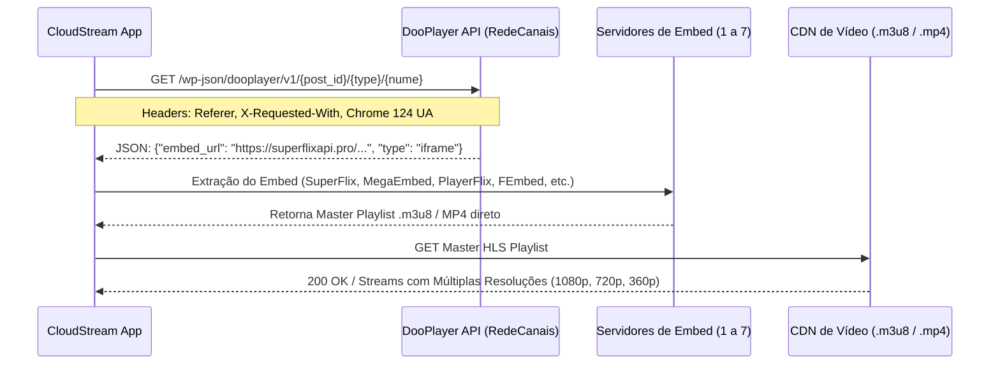

# 📑 Dossiê Técnico Mestre: Engenharia Reversa e Arquitetura do RedeCanais (`RedeCanais`)

**Repositório Fonte:** [`https://github.com/franciscoalro/kythourcl`](https://github.com/franciscoalro/kythourcl)  
**Repositório de Distribuição:** [`https://github.com/franciscoalro/kythourcl-dist`](https://github.com/franciscoalro/kythourcl-dist)  
**Domínio Oficial Ativo:** `https://www3.redecanais.vip` (Espelho ativo com bypass de WAF do `redecanais.af`)  
**Data do Dossiê:** 21/08/2026  
**Versão do Plugin:** `v43`

---

## 1. 🌐 Infraestrutura de Rede e Domínios

O RedeCanais opera uma infraestrutura distribuída com múltiplos domínios e camadas de redirecionamento/proteção:

| Domínio / Espelho | Status HTTP | Comportamento / Função |
| :--- | :---: | :--- |
| `https://redecanais.af/` | `403 Forbidden` | Domínio principal com proteção ativa Cloudflare Turnstile (`Cf-Mitigated: challenge`). |
| `https://www3.redecanais.vip/` | `200 OK` | **Espelho operacional oficial** com acesso direto ao catálogo, API DooPlayer e busca. |
| `https://redecanais.zip/` | `301 -> 200` | Gateway de redirecionamento para o espelho ativo via Google URL bounce. |
| `https://redecanais.fm/` | `301 -> 200` | Gateway de redirecionamento secundário. |
| `https://www16.redecanais.in/` | `200 OK` | Espelho de contingência para regiões com bloqueio DNS. |

---

## 2. 🧭 Catálogo, Taxonomia e Rotas

A plataforma é construída sobre o framework **DooPlay Engine (WordPress)** com rotas amigáveis:

```
https://www3.redecanais.vip/
├── /filme/                      [Catálogo de Filmes - 1500+ páginas]
│   └── /filme/page/{n}/
├── /serie/                      [Catálogo de Séries]
│   └── /serie/page/{n}/
├── /genero/{slug}/              [Filtro por Gêneros (25+ categorias)]
│   └── /genero/{slug}/page/{n}/
├── /ano/{ano}/                  [Filtro por Ano de Lançamento: 1902 a 2027]
│   └── /ano/{ano}/page/{n}/
└── /search/{query}/             [Motor de Busca Oficial]
    └── /search/{query}/page/{n}/
```

### 2.1 Matriz de Gêneros
* **Ação:** `/genero/acao/`
* **Animação / Desenhos:** `/genero/animacao/`
* **Aventura:** `/genero/aventura/`
* **Comédia:** `/genero/comedia/`
* **Crime:** `/genero/crime/`
* **Documentário:** `/genero/documentario/`
* **Drama:** `/genero/drama/`
* **Ficção Científica:** `/genero/ficcao-cientifica/`
* **Terror:** `/genero/terror/`
* **Suspense / Thriller:** `/genero/suspense/`
* **Romance:** `/genero/romance/`
* **Animes:** `/genero/animes/`
* **Doramas:** `/genero/doramas/`
* **Guerra:** `/genero/guerra/`
* **Faroeste:** `/genero/faroeste/`

---

## 3. 🔍 Mecanismo de Busca (`Search Engine`)

Ao contrário de sites que aceitam queries brutas com caracteres especiais via `?s=`, o RedeCanais implementa um template de rotas:

* **Endpoint Oficial:** `https://www3.redecanais.vip/search/{slug}/`
* **Paginação de Busca:** `https://www3.redecanais.vip/search/{slug}/page/{n}/`
* **Algoritmo de Sanitização de Slug:**
  1. Decomposição Unicode (`Normalizer.Form.NFD`) para remover acentos e diacríticos (*ex: "Coração" -> "Coracao"*).
  2. Substituição de pontuação e caracteres especiais por hífens (*ex: "Capitão América: Guerra Civil" -> "capitao-america-guerra-civil"*).
  3. Remoção de hífens duplicados e encoding UTF-8 seguro.

---

## 4. 🎬 Metadados e Séries/Episódios

### 4.1 Filmes (`/filme/{slug}/`)
* **Título:** `h1.entry-title`, `.sheader .data h1` (com higienização de sufixos de branding *" - RedeCanais"* e *"Assistir "*).
* **Poster:** `.poster img`, `.cover img` (resolução promovida de `w154/w185` para `w300/w500` no CDN do TMDB).
* **Sinopse:** `.sinopse p`, `.description p`, `.overview p` (filtrando disclaimers de rodapé).
* **Identificador de Post:** Extraído do atributo `data-post` na tag `#playeroptionsul li.dooplay_player_option`.

### 4.2 Séries e Temporadas (`/serie/{slug}/`)
* **Contêiner de Temporadas:** `#seasons`, `.seasons`, `.se-c`
* **Grade de Episódios:** `.se-a ul.episodios li`, `.episode-link-wrapper`
* **Padrão de Links:** `https://www3.redecanais.vip/episodio/{slug}-{temporada}x{episodio}/`
* **Numeração de Temporada/Episódio:** Extração por regex `(\d+)\s*[-xX]\s*(\d+)` no `.numerando` ou no slug da URL.

---

## 5. ⚡ Infraestrutura de Players e Servidores de Vídeo

O RedeCanais utiliza o backend **DooPlayer REST API** com fallback para **Admin-AJAX**:



### 5.1 Os 7 Servidores Suportados:
1. **Servidor 1 - SuperFlixAPI (`superflixapi.pro`)**: HLS Master Playlist com áudio Dublado/Legendado.
2. **Servidor 2 - MegaEmbed (`megaembed.com`)**: Player HLS multi-qualidade adaptativo.
3. **Servidor 3 - PlayerFlixAPI (`playerflixapi.com`)**: Resolução via IMDb/TMDB com faixas de áudio sincronizadas.
4. **Servidor 4 - FEmbed (`fembed.lol`)**: API JSON nativa `/api/source/{id}` com resoluções 360p, 720p, 1080p.
5. **Servidor 5 - EmbedPlayer (`embed.embedplayer.site`)**: Player embutido com payload HLS.
6. **Servidor 6 - EmbedPlay (`embedplay.one`)**: Stream HLS direto na tag `<video>`.
7. **Servidor 7 - VSEmbed (`vsembed.ru`)**: Manifest multi-áudio com suporte prioritário a Português (`ds_lang=pob,pt,en`).
